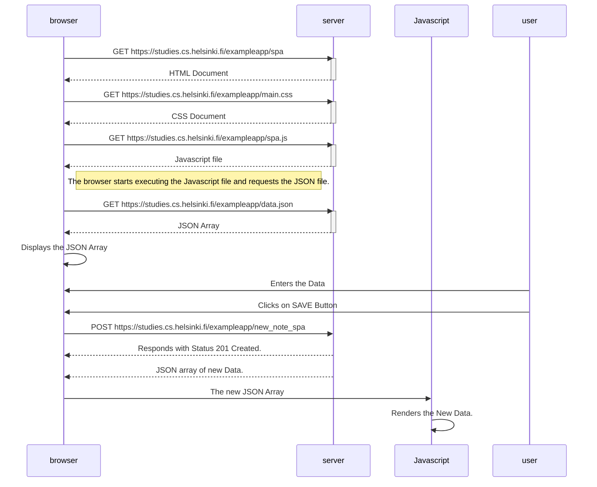

```mermaid
sequenceDiagram
    participant browser
    participant server
    participant Javascript
    participant user

    browser ->> server : GET https://studies.cs.helsinki.fi/exampleapp/spa
    activate server
    server -->> browser : HTML Document
    deactivate server

    browser ->> server : GET https://studies.cs.helsinki.fi/exampleapp/main.css
    activate server
    server -->> browser : CSS Document
    deactivate server

    browser ->> server : GET https://studies.cs.helsinki.fi/exampleapp/spa.js
    activate server
    server -->> browser : Javascript file
    deactivate server

    Note right of browser : The browser starts executing the Javascript file and requests the JSON file.
    browser ->> server : GET https://studies.cs.helsinki.fi/exampleapp/data.json
    activate server
    server -->> browser : JSON Array
    deactivate server
    browser ->> browser : Displays the JSON Array

    user ->> browser : Enters the Data
    user ->> browser : Clicks on SAVE Button
    browser ->> server : POST https://studies.cs.helsinki.fi/exampleapp/new_note_spa
    server -->> browser : Responds with Status 201 Created.
    server -->> browser : JSON array of new Data.
    browser ->> Javascript : The new JSON Array
    Javascript ->> Javascript : Renders the New Data.

```